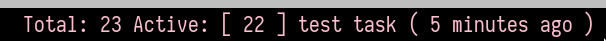

# i3blocks taskwarrior clojure

An [i3blocks](https://github.com/vivien/i3blocks) block for displaying [Taskwarrior](https://taskwarrior.org/) tasks in your [i3bar](https://i3wm.org/docs/userguide.html#status_command). Written in [Clojure](https://clojure.org/) for using with [babashka](https://github.com/borkdude/babashka) (a native fast-starting Clojure scripting environment).

1. No active tasks:

    

2. Active task (with optional timeago bash script):

    

3. Active task (without optional timeago bash script):

    

## Requisites

1. `babashka`
2. `i3blocks`

## Usage

1. Copy `./i3blocks-task` (and optionally `./timeago`) in your `$PATH`.
2. In your `i3blocks` config file:

    ```config
    [taskw]
    full_text=...
    command=i3blocks-task
    interval=10
    format=json
    ```

3. Restart `i3`
